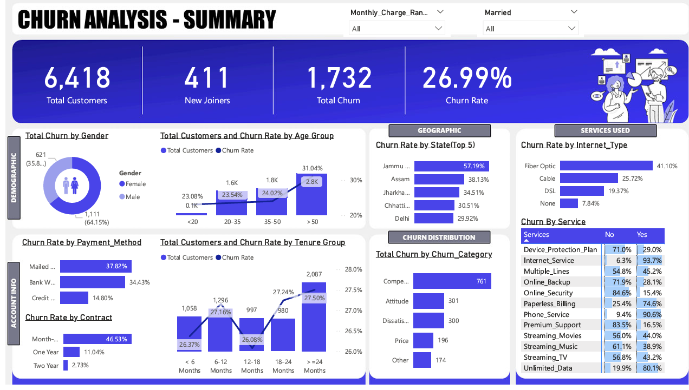

# 📊 Telecom Churn Analysis Dashboard

This project presents a **Telecom Churn Analysis Dashboard** developed using **Power BI** with **MySQL** as the backend data source. The goal is to identify customer churn patterns and key insights to help telecom businesses take proactive retention measures.

---

## 🎯 Objective

To analyze customer behavior and churn trends by leveraging demographic, service usage, and account-related data.

The dashboard helps:

- Identify high-risk customers likely to churn
- Highlight churn drivers by gender, age, geography, contract type, and services
- Support business strategies for customer retention and revenue optimization
- Improve customer engagement through data-driven decisions

---

## 🛠️ Tools & Technologies Used

- **Database:** MySQL
- **Visualization Tool:** Power BI
- **Language:** SQL
- **Dataset Format:** CSV

---

## 📈 Dashboard Features

The dashboard provides interactive visualizations with filters and slicers for deeper analysis.

### 🔹 Summary KPIs

- **Total Customers:** 6,418
- **New Joiners:** 411
- **Total Churn:** 1,732
- **Churn Rate:** 26.99%

### 🔹 Demographic Insights

- **Churn by Gender:** Higher among males (64.15%)
- **Churn by Age Group:** Highest in customers aged above 50 years (31.04%)

### 🔹 Geographic Analysis

Top states with higher churn rate:

- Jammu & Kashmir – 57.19%
- Assam
- Jharkhand
- Chhattisgarh
- Delhi

### 🔹 Service & Account Analysis

**Contract Type**

- Month-to-month contracts show the highest churn rate (46.53%)

**Payment Method**

- Mailed check users have the highest churn (37.82%)

**Internet Service Type**

- Fiber Optic users exhibit the highest churn (41.10%)

**Service Usage Patterns**

- 90.6% churners had Phone Service
- 93.7% churners had Internet Service
- Customers without premium services showed higher churn tendency

---

## 🔍 Churn Categories & Reasons

Major reasons identified behind customer churn:

- Competitor influence
- Poor customer support experience
- Service dissatisfaction
- Pricing concerns
- Lack of premium features

---

## 📷 Dashboard Preview



---

## 💡 Key Business Insights

### 📉 Short-Term Contracts = Higher Churn

Customers using month-to-month plans are significantly more likely to leave.

### 🔐 Premium Services Improve Retention

Users with Online Backup, Device Protection, and Premium Support showed lower churn.

### 📍 Region-Based Strategy

States such as Jammu & Kashmir require targeted customer retention strategies.

### 👥 Senior Customers Need Attention

Customers above age 50 have the highest churn probability.

---

## 📁 Project Structure

```bash
📦 telecom-churn-analysis
│── 📁 mysql
│   └── SQL queries and schema

│── 📄 Churn Analysis.pbix
│── 📄 Churn Analysis.pdf
│── 📄 Customer_Data.csv
│── 📄 churn-analysis.png
└── 📄 README.md
```

---

## 🚀 Project Workflow

1. Data Collection from telecom customer dataset
2. Data Cleaning and preprocessing in SQL
3. Import dataset into MySQL
4. Data analysis using SQL queries
5. Dashboard development in Power BI
6. Business insight generation
7. Customer churn analysis

---

## 📌 Key Insights Summary

✅ High churn among month-to-month customers

✅ Elderly customers (>50 years) show maximum churn

✅ Fiber Optic users churn more frequently

✅ Customers without additional services tend to leave

✅ Certain states require targeted retention campaigns

---

## 👤 Author

**Himanshu**

📎 GitHub Repository:  
https://github.com/Himanshu-25178/telecom-customer-churn-

[](https://github.com/Himanshu-25178/telecom-customer-churn-)

---

⭐ If you found this project useful, consider giving it a star.
